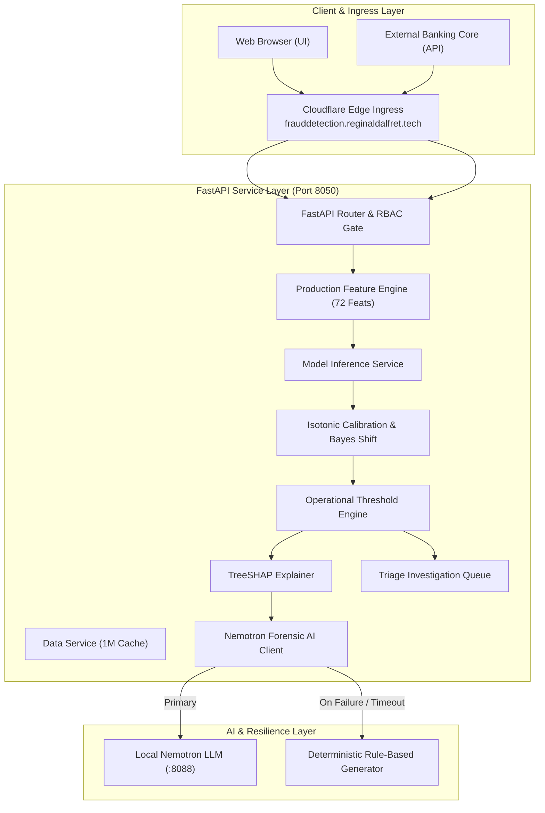

# END-TO-END SYSTEM ARCHITECTURE
## Supervised Bank Fraud Classification System

---

## 1. Causal Inference Pipeline
The inference lifecycle executes in 6 deterministic stages:
1. **Raw Row Ingestion:** Schema parsing and Pydantic v2 data contract verification.
2. **Sentinel Transformation:** Negative sentinel extraction (`-1.0` $\to$ missingness flags) and numerical imputation.
3. **Causal Feature Engineering:** Velocity burst ratios ($6\text{h}/4\text{w}$), synthetic identity mismatch $(1 - \text{sim}) \times \text{free\_email}$, thin-file composites, financial risk ratios.
4. **LightGBM Scoring:** Fast tree traversal ($0.0040\text{ ms/sample}$).
5. **Bayesian Prior Shift & Calibration:** Restores true test-time prevalence prior from 10:1 undersampled training subspace, followed by isotonic temperature mapping.
6. **Decision & Attribution:** Threshold comparison against frozen target ($T=0.0382$ for $5\%$ FPR) with local TreeSHAP attribution and Nemotron briefing generation.
